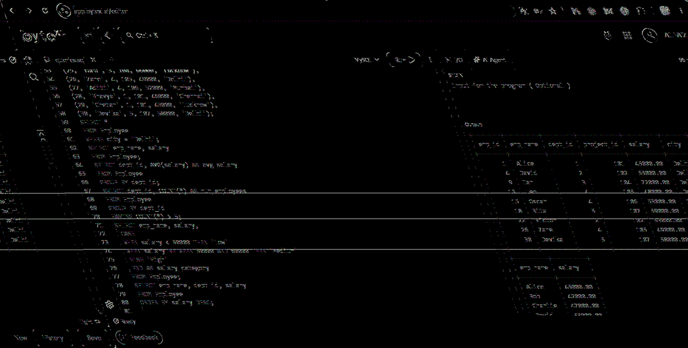

# EXPERIMENT - 3

## AIM
Create an Employee–Department–Project schema. Insert at least 30 employees across 5 departments and 8 projects. Write SQL queries demonstrating selection, projection, aggregates, `GROUP BY`, `HAVING`, `CASE` expressions, and `ORDER BY`.

---

## SOURCE CODE

```sql
CREATE TABLE Department ( 
    dept_id INT PRIMARY KEY, 
    dept_name VARCHAR(50) 
);

CREATE TABLE Project ( 
    project_id INT PRIMARY KEY, 
    project_name VARCHAR(50), 
    dept_id INT, 
    FOREIGN KEY (dept_id) REFERENCES Department(dept_id) 
);

CREATE TABLE Employee ( 
    emp_id INT PRIMARY KEY, 
    emp_name VARCHAR(50), 
    dept_id INT, 
    project_id INT, 
    salary DECIMAL(10,2), 
    city VARCHAR(50), 
    FOREIGN KEY (dept_id) REFERENCES Department(dept_id), 
    FOREIGN KEY (project_id) REFERENCES Project(project_id) 
);

-- Insert Departments
INSERT INTO Department VALUES 
(1, 'HR'), (2, 'Finance'), (3, 'IT'), (4, 'Marketing'), (5, 'Operations');

-- Insert Projects
INSERT INTO Project VALUES 
(101, 'Recruitment System', 1), (102, 'Payroll Automation', 2), 
(103, 'Cybersecurity Upgrade', 3), (104, 'Website Revamp', 3), 
(105, 'Ad Campaign', 4), (106, 'Market Research', 4), 
(107, 'Logistics Optimization', 5), (108, 'Inventory System', 5);

-- Insert 30 Employees
INSERT INTO Employee VALUES 
(1, 'Alice', 1, 101, 45000, 'Delhi'), 
(2, 'Bob', 1, 101, 42000, 'Mumbai'), 
(3, 'Charlie', 1, 101, 47000, 'Pune'), 
(4, 'David', 2, 102, 55000, 'Delhi'), 
(5, 'Eva', 2, 102, 60000, 'Lucknow'), 
(6, 'Frank', 2, 102, 52000, 'Chennai'), 
(7, 'Grace', 3, 103, 70000, 'Bangalore'), 
(8, 'Hannah', 3, 103, 68000, 'Hyderabad'), 
(9, 'Ian', 3, 104, 72000, 'Delhi'), 
(10, 'Jack', 3, 104, 65000, 'Pune'), 
(11, 'Karen', 3, 104, 64000, 'Mumbai'), 
(12, 'Leo', 4, 105, 48000, 'Delhi'), 
(13, 'Mia', 4, 105, 50000, 'Lucknow'), 
(14, 'Nina', 4, 106, 51000, 'Chennai'), 
(15, 'Oscar', 4, 106, 53000, 'Delhi'), 
(16, 'Paul', 5, 107, 56000, 'Hyderabad'), 
(17, 'Quinn', 5, 107, 57000, 'Bangalore'), 
(18, 'Rita', 5, 107, 59000, 'Delhi'), 
(19, 'Sam', 5, 108, 60000, 'Lucknow'), 
(20, 'Tina', 5, 108, 61000, 'Mumbai'), 
(21, 'Uma', 5, 108, 62000, 'Chennai'), 
(22, 'Victor', 2, 102, 53000, 'Delhi'), 
(23, 'Wendy', 2, 102, 54000, 'Hyderabad'), 
(24, 'Xavier', 3, 103, 71000, 'Bangalore'), 
(25, 'Yara', 3, 104, 66000, 'Lucknow'), 
(26, 'Zane', 4, 105, 49000, 'Delhi'), 
(27, 'Aditi', 4, 106, 52000, 'Mumbai'), 
(28, 'Bhavya', 1, 101, 46000, 'Chennai'), 
(29, 'Chetan', 1, 101, 43000, 'Lucknow'), 
(30, 'Devika', 5, 107, 58000, 'Delhi');

-- Query 1: Selection
SELECT * 
FROM Employee 
WHERE city = 'Delhi';

-- Query 2: Projection
SELECT emp_name, salary 
FROM Employee;

-- Query 3: Aggregate with GROUP BY
SELECT dept_id, AVG(salary) AS avg_salary 
FROM Employee 
GROUP BY dept_id;

-- Query 4: GROUP BY with HAVING
SELECT dept_id, COUNT(*) AS num_employees 
FROM Employee 
GROUP BY dept_id 
HAVING COUNT(*) > 5;

-- Query 5: CASE Expression
SELECT emp_name, salary, 
    CASE 
        WHEN salary < 50000 THEN 'Low' 
        WHEN salary BETWEEN 50000 AND 60000 THEN 'Medium' 
        ELSE 'High' 
    END AS salary_category 
FROM Employee;

-- Query 6: ORDER BY
SELECT emp_name, dept_id, salary 
FROM Employee 
ORDER BY salary DESC;
```

---

## OUTPUT



### Tabular Results

#### 1. Selection (`WHERE city = 'Delhi'`)
| emp_id | emp_name | dept_id | project_id | salary | city |
| :--- | :--- | :--- | :--- | :--- | :--- |
| 1 | Alice | 1 | 101 | 45000.00 | Delhi |
| 4 | David | 2 | 102 | 55000.00 | Delhi |
| 9 | Ian | 3 | 104 | 72000.00 | Delhi |
| 12 | Leo | 4 | 105 | 48000.00 | Delhi |
| 15 | Oscar | 4 | 106 | 53000.00 | Delhi |
| 18 | Rita | 5 | 107 | 59000.00 | Delhi |
| 22 | Victor | 2 | 102 | 53000.00 | Delhi |
| 26 | Zane | 4 | 105 | 49000.00 | Delhi |
| 30 | Devika | 5 | 107 | 58000.00 | Delhi |

#### 2. Projection (`SELECT emp_name, salary`)
| emp_name | salary |
| :--- | :--- |
| Alice | 45000.00 |
| Bob | 42000.00 |
| Charlie | 47000.00 |
| David | 55000.00 |
| Eva | 60000.00 |

#### 3. Aggregates with `GROUP BY`
| dept_id | avg_salary |
| :--- | :--- |
| 1 | 44600.000000 |
| 2 | 54800.000000 |
| 3 | 68000.000000 |
| 4 | 50500.000000 |
| 5 | 59000.000000 |

#### 4. `GROUP BY` with `HAVING COUNT(*) > 5`
| dept_id | num_employees |
| :--- | :--- |
| 3 | 7 |
| 5 | 6 |

#### 5. `CASE` Expression
| emp_name | salary | salary_category |
| :--- | :--- | :--- |
| Alice | 45000.00 | Low |
| Bob | 42000.00 | Low |
| David | 55000.00 | Medium |
| Grace | 70000.00 | High |

#### 6. `ORDER BY salary DESC`
| emp_name | dept_id | salary |
| :--- | :--- | :--- |
| Ian | 3 | 72000.00 |
| Xavier | 3 | 71000.00 |
| Grace | 3 | 70000.00 |
| Hannah | 3 | 68000.00 |
| Yara | 3 | 66000.00 |
