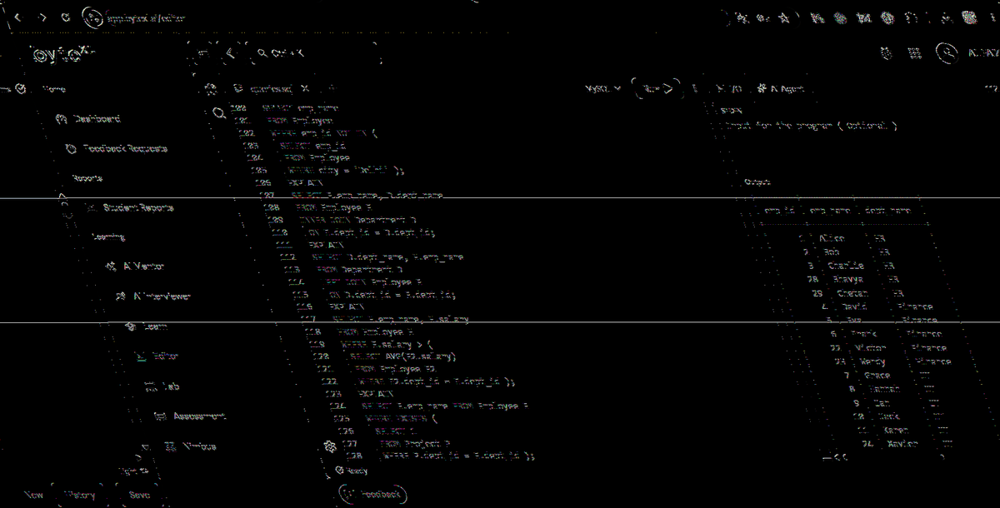

# EXPERIMENT - 4

## AIM
Using the Employee schema, write queries with `INNER JOIN`, `LEFT JOIN`, `self-join`, `3-way join`, correlated subqueries, `EXISTS`, and simulated `INTERSECT` and `EXCEPT`. Compare execution plans using `EXPLAIN`.

---

## SOURCE CODE

```sql
-- 1. Create Tables
CREATE TABLE Department ( 
    dept_id INT PRIMARY KEY, 
    dept_name VARCHAR(50) 
); 

CREATE TABLE Project ( 
    project_id INT PRIMARY KEY, 
    project_name VARCHAR(50), 
    dept_id INT, 
    FOREIGN KEY (dept_id) REFERENCES Department(dept_id) 
); 

CREATE TABLE Employee ( 
    emp_id INT PRIMARY KEY, 
    emp_name VARCHAR(50), 
    dept_id INT, 
    project_id INT, 
    salary DECIMAL(10,2), 
    city VARCHAR(50), 
    FOREIGN KEY (dept_id) REFERENCES Department(dept_id), 
    FOREIGN KEY (project_id) REFERENCES Project(project_id) 
); 

-- 2. Insert Departments
INSERT INTO Department VALUES 
(1, 'HR'), (2, 'Finance'), (3, 'IT'), (4, 'Marketing'), (5, 'Operations'); 

-- 3. Insert Projects
INSERT INTO Project VALUES 
(101, 'Recruitment System', 1), (102, 'Payroll Automation', 2), 
(103, 'Cybersecurity Upgrade', 3), (104, 'Website Revamp', 3), 
(105, 'Ad Campaign', 4), (106, 'Market Research', 4), 
(107, 'Logistics Optimization', 5), (108, 'Inventory System', 5); 

-- 4. Insert 30 Employees
INSERT INTO Employee VALUES 
(1, 'Alice', 1, 101, 45000, 'Delhi'), 
(2, 'Bob', 1, 101, 42000, 'Mumbai'), 
(3, 'Charlie', 1, 101, 47000, 'Pune'), 
(4, 'David', 2, 102, 55000, 'Delhi'), 
(5, 'Eva', 2, 102, 60000, 'Lucknow'), 
(6, 'Frank', 2, 102, 52000, 'Chennai'), 
(7, 'Grace', 3, 103, 70000, 'Bangalore'), 
(8, 'Hannah', 3, 103, 68000, 'Hyderabad'), 
(9, 'Ian', 3, 104, 72000, 'Delhi'), 
(10, 'Jack', 3, 104, 65000, 'Pune'), 
(11, 'Karen', 3, 104, 64000, 'Mumbai'), 
(12, 'Leo', 4, 105, 48000, 'Delhi'), 
(13, 'Mia', 4, 105, 50000, 'Lucknow'), 
(14, 'Nina', 4, 106, 51000, 'Chennai'), 
(15, 'Oscar', 4, 106, 53000, 'Delhi'), 
(16, 'Paul', 5, 107, 56000, 'Hyderabad'), 
(17, 'Quinn', 5, 107, 57000, 'Bangalore'), 
(18, 'Rita', 5, 107, 59000, 'Delhi'), 
(19, 'Sam', 5, 108, 60000, 'Lucknow'), 
(20, 'Tina', 5, 108, 61000, 'Mumbai'), 
(21, 'Uma', 5, 108, 62000, 'Chennai'), 
(22, 'Victor', 2, 102, 53000, 'Delhi'), 
(23, 'Wendy', 2, 102, 54000, 'Hyderabad'), 
(24, 'Xavier', 3, 103, 71000, 'Bangalore'), 
(25, 'Yara', 3, 104, 66000, 'Lucknow'), 
(26, 'Zane', 4, 105, 49000, 'Delhi'), 
(27, 'Aditi', 4, 106, 52000, 'Mumbai'), 
(28, 'Bhavya', 1, 101, 46000, 'Chennai'), 
(29, 'Chetan', 1, 101, 43000, 'Lucknow'), 
(30, 'Devika', 5, 107, 58000, 'Delhi'); 

-- ========================================================
-- ADVANCED JOINS & SUBQUERIES
-- ========================================================

-- 1. INNER JOIN: Retrieve employee name and department
SELECT E.emp_id, E.emp_name, D.dept_name  
FROM Employee E  
INNER JOIN Department D  
    ON E.dept_id = D.dept_id;   

-- 2. LEFT JOIN: All departments with associated employees
SELECT D.dept_id, D.dept_name, E.emp_name  
FROM Department D  
LEFT JOIN Employee E  
    ON D.dept_id = E.dept_id;  

-- 3. SELF-JOIN: Pair employees working in the same department
SELECT E1.emp_name AS Employee1, E2.emp_name AS Employee2, E1.dept_id  
FROM Employee E1  
INNER JOIN Employee E2  
    ON E1.dept_id = E2.dept_id  
    AND E1.emp_id < E2.emp_id;  

-- 4. 3-WAY JOIN: Employee, Project, and Department
SELECT E.emp_name, P.project_name, D.dept_name  
FROM Employee E  
INNER JOIN Project P  
    ON E.project_id = P.project_id  
INNER JOIN Department D  
    ON E.dept_id = D.dept_id;  

-- 5. CORRELATED SUBQUERY: Employees earning more than their department's average
SELECT E.emp_name, E.dept_id, E.salary  
FROM Employee E  
WHERE E.salary > (  
    SELECT AVG(E2.salary)  
    FROM Employee E2  
    WHERE E2.dept_id = E.dept_id );  

-- 6. EXISTS SUBQUERY: Employees in departments that have active projects
SELECT E.emp_id, E.emp_name, E.dept_id  
FROM Employee E  
WHERE EXISTS (  
    SELECT 1  
    FROM Project P  
    WHERE P.dept_id = E.dept_id );  

-- 7. SIMULATED INTERSECT: Employees in Delhi earning > 60000
SELECT emp_name  
FROM Employee  
WHERE emp_id IN (  
    SELECT emp_id  
    FROM Employee  
    WHERE city = 'Delhi' )  
AND emp_id IN (  
    SELECT emp_id  
    FROM Employee  
    WHERE salary > 60000 );  

-- 8. SIMULATED EXCEPT: Employees not located in Delhi
SELECT emp_name 
FROM Employee  
WHERE emp_id NOT IN (  
    SELECT emp_id  
    FROM Employee  
    WHERE city = 'Delhi' );   

-- ========================================================
-- EXECUTION PLAN COMPARISON WITH EXPLAIN
-- ========================================================

EXPLAIN  
SELECT E.emp_name, D.dept_name  
FROM Employee E  
INNER JOIN Department D  
    ON E.dept_id = D.dept_id;  

EXPLAIN  
SELECT D.dept_name, E.emp_name  
FROM Department D  
LEFT JOIN Employee E  
    ON D.dept_id = E.dept_id;  

EXPLAIN  
SELECT E.emp_name, E.salary  
FROM Employee E  
WHERE E.salary > (  
    SELECT AVG(E2.salary)  
    FROM Employee E2  
    WHERE E2.dept_id = E.dept_id );  

EXPLAIN  
SELECT E.emp_name FROM Employee E  
WHERE EXISTS (  
    SELECT 1  
    FROM Project P  
    WHERE P.dept_id = E.dept_id ); 
```

---

## OUTPUT


