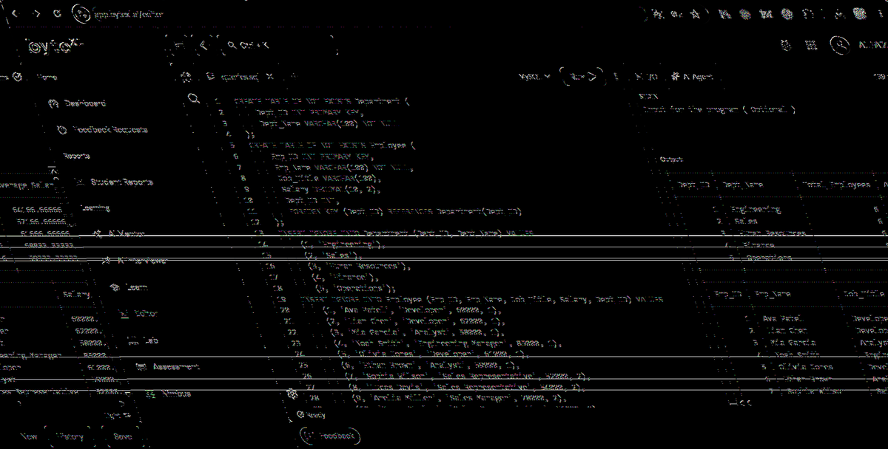

# EXPERIMENT - 5

## AIM
To create SQL views for department salary summary and employee hierarchy, test the updatability of views, and implement a recursive Common Table Expression (CTE) to display reporting chains.

---

## SOURCE CODE

```sql
-- 1. Create Tables
CREATE TABLE IF NOT EXISTS Department ( 
    Dept_ID INT PRIMARY KEY, 
    Dept_Name VARCHAR(100) NOT NULL 
); 

CREATE TABLE IF NOT EXISTS Employee ( 
    Emp_ID INT PRIMARY KEY, 
    Emp_Name VARCHAR(100) NOT NULL, 
    Job_Title VARCHAR(100), 
    Salary DECIMAL(10, 2), 
    Dept_ID INT, 
    FOREIGN KEY (Dept_ID) REFERENCES Department(Dept_ID) 
); 

-- 2. Insert Departments
INSERT IGNORE INTO Department (Dept_ID, Dept_Name) VALUES 
(1, 'Engineering'), 
(2, 'Sales'), 
(3, 'Human Resources'), 
(4, 'Finance'), 
(5, 'Operations'); 

-- 3. Insert Employees
INSERT IGNORE INTO Employee (Emp_ID, Emp_Name, Job_Title, Salary, Dept_ID) VALUES 
(1, 'Ava Patel', 'Developer', 60000, 1), 
(2, 'Liam Chen', 'Developer', 62000, 1), 
(3, 'Mia Garcia', 'Analyst', 58000, 1), 
(4, 'Noah Smith', 'Engineering Manager', 85000, 1), 
(5, 'Olivia Jones', 'Developer', 61000, 1), 
(6, 'Ethan Brown', 'Analyst', 59000, 1), 
(7, 'Sophia Wilson', 'Sales Representative', 52000, 2), 
(8, 'Lucas Davis', 'Sales Representative', 54000, 2), 
(9, 'Amelia Miller', 'Sales Manager', 78000, 2), 
(10, 'James Taylor', 'Sales Representative', 51000, 2), 
(11, 'Isabella Anderson', 'Sales Representative', 53000, 2), 
(12, 'Benjamin Thomas', 'Sales Representative', 55000, 2), 
(13, 'Charlotte Moore', 'HR Specialist', 57000, 3), 
(14, 'Elijah Martin', 'HR Specialist', 56000, 3), 
(15, 'Harper Lee', 'Recruiter', 59000, 3), 
(16, 'Daniel White', 'HR Manager', 80000, 3), 
(17, 'Evelyn Harris', 'HR Specialist', 58000, 3), 
(18, 'Henry Clark', 'Recruiter', 60000, 3), 
(19, 'Abigail Lewis', 'Accountant', 63000, 4), 
(20, 'Sebastian Walker', 'Accountant', 64000, 4), 
(21, 'Emily Hall', 'Finance Manager', 88000, 4), 
(22, 'Jack Allen', 'Accountant', 65000, 4), 
(23, 'Ella Young', 'Financial Analyst', 67000, 4), 
(24, 'Owen King', 'Financial Analyst', 66000, 4), 
(25, 'Grace Wright', 'Operations Specialist', 55000, 5), 
(26, 'Matthew Scott', 'Operations Specialist', 56000, 5), 
(27, 'Chloe Green', 'Operations Manager', 82000, 5), 
(28, 'Wyatt Baker', 'Operations Specialist', 57000, 5), 
(29, 'Lily Adams', 'Coordinator', 52000, 5), 
(30, 'Gabriel Nelson', 'Coordinator', 54000, 5); 

-- 4. Create View: Department Salary Summary
CREATE VIEW Department_Salary_Summary AS 
SELECT 
    D.Dept_ID, 
    D.Dept_Name, 
    COUNT(E.Emp_ID) AS Total_Employees, 
    AVG(E.Salary) AS Average_Salary, 
    MAX(E.Salary) AS Maximum_Salary, 
    MIN(E.Salary) AS Minimum_Salary 
FROM Department D 
LEFT JOIN Employee E 
    ON D.Dept_ID = E.Dept_ID 
GROUP BY D.Dept_ID, D.Dept_Name; 

SELECT * FROM Department_Salary_Summary; 

-- 5. Add Self-Referencing Manager_ID Column & Foreign Key
ALTER TABLE Employee 
ADD Manager_ID INT NULL; 

ALTER TABLE Employee 
ADD CONSTRAINT FK_Employee_Manager 
FOREIGN KEY (Manager_ID) 
REFERENCES Employee(Emp_ID); 

-- Assign Managers
UPDATE Employee SET Manager_ID = 4 WHERE Emp_ID IN (1, 2, 3, 5, 6); 
UPDATE Employee SET Manager_ID = 9 WHERE Emp_ID IN (7, 8, 10, 11, 12); 
UPDATE Employee SET Manager_ID = 16 WHERE Emp_ID IN (13, 14, 15, 17, 18); 
UPDATE Employee SET Manager_ID = 21 WHERE Emp_ID IN (19, 20, 22, 23, 24); 
UPDATE Employee SET Manager_ID = 27 WHERE Emp_ID IN (25, 26, 28, 29, 30); 

-- 6. Create View: Employee Hierarchy
CREATE VIEW Employee_Hierarchy AS 
SELECT 
    E.Emp_ID, 
    E.Emp_Name, 
    E.Job_Title, 
    E.Salary, 
    E.Manager_ID, 
    M.Emp_Name AS Manager_Name 
FROM Employee E 
LEFT JOIN Employee M 
    ON E.Manager_ID = M.Emp_ID; 

SELECT * FROM Employee_Hierarchy; 

-- 7. Test Updatability of Views
UPDATE Employee 
SET Salary = 60000 
WHERE Emp_ID = 1; 

SELECT 
    Emp_ID, 
    Emp_Name, 
    Salary 
FROM Employee 
WHERE Emp_ID = 1; 

-- 8. Recursive CTE: Hierarchical Reporting Chains
WITH RECURSIVE Employee_Chain AS 
( 
    -- Anchor member: top-level employees (no manager)
    SELECT 
        Emp_ID, 
        Emp_Name, 
        Manager_ID, 
        1 AS Level 
    FROM Employee 
    WHERE Manager_ID IS NULL 

    UNION ALL 

    -- Recursive member: direct and indirect reports
    SELECT 
        E.Emp_ID, 
        E.Emp_Name, 
        E.Manager_ID, 
        EC.Level + 1 
    FROM Employee E 
    INNER JOIN Employee_Chain EC 
        ON E.Manager_ID = EC.Emp_ID 
) 
SELECT 
    Emp_ID, 
    Emp_Name, 
    Manager_ID, 
    Level 
FROM Employee_Chain 
ORDER BY Level, Emp_ID;
```

---

## OUTPUT



### Tabular Summary

#### 1. `Department_Salary_Summary` View
| Dept_ID | Dept_Name | Total_Employees | Average_Salary | Maximum_Salary | Minimum_Salary |
| :--- | :--- | :--- | :--- | :--- | :--- |
| 1 | Engineering | 6 | 64166.67 | 85000.00 | 58000.00 |
| 2 | Sales | 6 | 57166.67 | 78000.00 | 51000.00 |
| 3 | Human Resources | 6 | 61666.67 | 80000.00 | 56000.00 |
| 4 | Finance | 6 | 68833.33 | 88000.00 | 63000.00 |
| 5 | Operations | 6 | 59333.33 | 82000.00 | 52000.00 |

#### 2. `Employee_Hierarchy` View (Sample)
| Emp_ID | Emp_Name | Job_Title | Salary | Manager_ID | Manager_Name |
| :--- | :--- | :--- | :--- | :--- | :--- |
| 1 | Ava Patel | Developer | 60000.00 | 4 | Noah Smith |
| 2 | Liam Chen | Developer | 62000.00 | 4 | Noah Smith |
| 3 | Mia Garcia | Analyst | 58000.00 | 4 | Noah Smith |
| 4 | Noah Smith | Engineering Manager | 85000.00 | NULL | NULL |

#### 3. Recursive CTE Hierarchy Levels
| Emp_ID | Emp_Name | Manager_ID | Level |
| :--- | :--- | :--- | :--- |
| 4 | Noah Smith | NULL | 1 |
| 9 | Amelia Miller | NULL | 1 |
| 16 | Daniel White | NULL | 1 |
| 21 | Emily Hall | NULL | 1 |
| 27 | Chloe Green | NULL | 1 |
| 1 | Ava Patel | 4 | 2 |
| 2 | Liam Chen | 4 | 2 |
| 3 | Mia Garcia | 4 | 2 |
| ... | ... | ... | ... |
