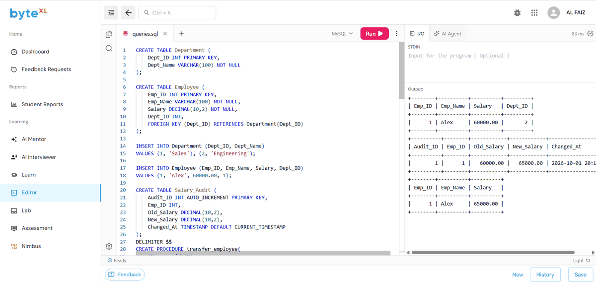

# EXPERIMENT - 6

## AIM
To create a stored procedure `transfer_employee(emp_id, new_dept_id)` with validation and error handling, and to implement triggers for salary validation and audit logging, including testing of edge cases.

---

## CONCEPTS COVERED

- **Stored Procedures**: Parameterized routines (`IN`, `OUT`).
- **Custom Exception Handling**: `SIGNAL SQLSTATE '45000' SET MESSAGE_TEXT = ...`
- **BEFORE UPDATE Trigger**: Data validation preventing negative salaries.
- **AFTER UPDATE Trigger**: Automatic audit trail into `Salary_Audit` using `OLD` and `NEW` keywords.

---

## SOURCE CODE

```sql
-- 1. Create Department and Employee Tables
CREATE TABLE Department ( 
    Dept_ID INT PRIMARY KEY, 
    Dept_Name VARCHAR(100) NOT NULL 
); 

CREATE TABLE Employee ( 
    Emp_ID INT PRIMARY KEY, 
    Emp_Name VARCHAR(100) NOT NULL, 
    Salary DECIMAL(10,2) NOT NULL, 
    Dept_ID INT, 
    FOREIGN KEY (Dept_ID) REFERENCES Department(Dept_ID) 
); 

-- 2. Insert Sample Records
INSERT INTO Department (Dept_ID, Dept_Name) 
VALUES (1, 'Sales'), (2, 'Engineering'); 

INSERT INTO Employee (Emp_ID, Emp_Name, Salary, Dept_ID) 
VALUES (1, 'Alex', 60000.00, 1); 

-- 3. Create Audit Table
CREATE TABLE Salary_Audit ( 
    Audit_ID INT AUTO_INCREMENT PRIMARY KEY, 
    Emp_ID INT, 
    Old_Salary DECIMAL(10,2), 
    New_Salary DECIMAL(10,2), 
    Changed_At TIMESTAMP DEFAULT CURRENT_TIMESTAMP 
); 

-- ========================================================
-- STORED PROCEDURE WITH VALIDATION & ERROR HANDLING
-- ========================================================

DELIMITER $$ 

CREATE PROCEDURE transfer_employee( 
    IN p_emp_id INT, 
    IN p_new_dept_id INT 
) 
BEGIN 
    DECLARE emp_count INT DEFAULT 0; 
    DECLARE dept_count INT DEFAULT 0; 

    -- Check if Employee exists
    SELECT COUNT(*) 
    INTO emp_count 
    FROM Employee 
    WHERE Emp_ID = p_emp_id; 

    -- Check if Department exists
    SELECT COUNT(*) 
    INTO dept_count 
    FROM Department 
    WHERE Dept_ID = p_new_dept_id; 

    IF emp_count = 0 THEN 
        SIGNAL SQLSTATE '45000' 
        SET MESSAGE_TEXT = 'Employee does not exist'; 
    ELSEIF dept_count = 0 THEN 
        SIGNAL SQLSTATE '45000' 
        SET MESSAGE_TEXT = 'Department does not exist'; 
    ELSE 
        UPDATE Employee 
        SET Dept_ID = p_new_dept_id 
        WHERE Emp_ID = p_emp_id; 
    END IF; 
END $$ 

DELIMITER ; 

-- Execute Stored Procedure
CALL transfer_employee(1, 2); 

-- Verify Department Change
SELECT * 
FROM Employee 
WHERE Emp_ID = 1; 

-- Edge Case Tests (Intentionally raise custom errors):
-- CALL transfer_employee(999, 2); -- Error: Employee does not exist
-- CALL transfer_employee(1, 999); -- Error: Department does not exist

-- ========================================================
-- TRIGGERS
-- ========================================================

-- Trigger 1: BEFORE UPDATE (Salary Validation)
DELIMITER $$ 

CREATE TRIGGER before_employee_salary_update 
BEFORE UPDATE ON Employee 
FOR EACH ROW 
BEGIN 
    IF NEW.Salary < 0 THEN 
        SIGNAL SQLSTATE '45000' 
        SET MESSAGE_TEXT = 'Salary cannot be negative'; 
    END IF; 
END $$ 

DELIMITER ; 

-- Edge Case Test (Negative Salary Validation):
-- UPDATE Employee SET Salary = -5000 WHERE Emp_ID = 1; 

-- Trigger 2: AFTER UPDATE (Audit Logging)
DELIMITER $$ 

CREATE TRIGGER after_employee_salary_update 
AFTER UPDATE ON Employee 
FOR EACH ROW 
BEGIN 
    IF OLD.Salary <> NEW.Salary THEN 
        INSERT INTO Salary_Audit 
        ( 
            Emp_ID, 
            Old_Salary, 
            New_Salary 
        ) 
        VALUES 
        ( 
            OLD.Emp_ID, 
            OLD.Salary, 
            NEW.Salary 
        ); 
    END IF; 
END $$ 

DELIMITER ; 

-- Test Triggers by Updating Salary
UPDATE Employee 
SET Salary = 65000 
WHERE Emp_ID = 1; 

-- Verify Audit Log and Updated Employee
SELECT * 
FROM Salary_Audit; 

SELECT 
    Emp_ID, 
    Emp_Name, 
    Salary 
FROM Employee 
WHERE Emp_ID = 1;
```

---

## OUTPUT



### Tabular Summary

#### 1. Transferred Employee Record
| Emp_ID | Emp_Name | Salary | Dept_ID |
| :--- | :--- | :--- | :--- |
| 1 | Alex | 60000.00 | 2 |

#### 2. Salary Audit Record (`Salary_Audit`)
| Audit_ID | Emp_ID | Old_Salary | New_Salary | Changed_At |
| :--- | :--- | :--- | :--- | :--- |
| 1 | 1 | 60000.00 | 65000.00 | 2026-10-01 20:11:23 |

#### 3. Employee Record After Salary Update
| Emp_ID | Emp_Name | Salary |
| :--- | :--- | :--- |
| 1 | Alex | 65000.00 |
