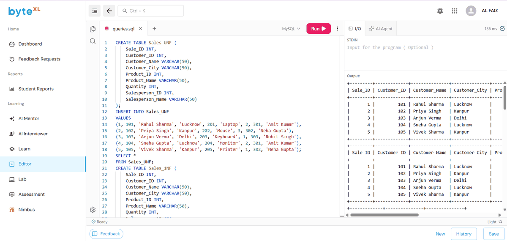

# EXPERIMENT - 7

## AIM
To normalize a denormalized Sales table from **UNF (Unnormalized Form)** to **3NF** and **BCNF (Boyce-Codd Normal Form)**, and to verify **lossless join decomposition** and **dependency preservation**.

---

## NORMALIZATION WORKFLOW

1. **UNF to 1NF**: Eliminate repeating groups and establish composite primary key `(Sale_ID, Product_ID)`.
2. **1NF to 2NF**: Remove partial functional dependencies:
   - `Customer_ID -> Customer_Name, Customer_City`
   - `Product_ID -> Product_Name`
   - `Salesperson_ID -> Salesperson_Name`
3. **2NF to 3NF / BCNF**: Eliminate transitive dependencies by decomposing into independent entity tables:
   - `Customer(Customer_ID, Customer_Name, Customer_City)`
   - `Product(Product_ID, Product_Name)`
   - `Salesperson(Salesperson_ID, Salesperson_Name)`
   - `Sales(Sale_ID, Customer_ID, Salesperson_ID)`
   - `Sale_Details(Sale_ID, Product_ID, Quantity)`

---

## SOURCE CODE

```sql
-- 1. Create Denormalized Table (UNF)
CREATE TABLE Sales_UNF ( 
    Sale_ID INT, 
    Customer_ID INT, 
    Customer_Name VARCHAR(50), 
    Customer_City VARCHAR(50), 
    Product_ID INT, 
    Product_Name VARCHAR(50), 
    Quantity INT, 
    Salesperson_ID INT, 
    Salesperson_Name VARCHAR(50) 
);

-- Insert Sample Data
INSERT INTO Sales_UNF VALUES 
(1, 101, 'Rahul Sharma', 'Lucknow', 201, 'Laptop', 2, 301, 'Amit Kumar'), 
(2, 102, 'Priya Singh', 'Kanpur', 202, 'Mouse', 3, 302, 'Neha Gupta'), 
(3, 103, 'Arjun Verma', 'Delhi', 203, 'Keyboard', 1, 303, 'Rohit Singh'), 
(4, 104, 'Sneha Gupta', 'Lucknow', 204, 'Monitor', 2, 301, 'Amit Kumar'), 
(5, 105, 'Vivek Sharma', 'Kanpur', 205, 'Printer', 1, 302, 'Neha Gupta');

SELECT * FROM Sales_UNF;

-- 2. First Normal Form (1NF)
CREATE TABLE Sales_1NF ( 
    Sale_ID INT, 
    Customer_ID INT, 
    Customer_Name VARCHAR(50), 
    Customer_City VARCHAR(50), 
    Product_ID INT, 
    Product_Name VARCHAR(50), 
    Quantity INT, 
    Salesperson_ID INT, 
    Salesperson_Name VARCHAR(50), 
    PRIMARY KEY (Sale_ID, Product_ID) 
);

INSERT INTO Sales_1NF 
SELECT * FROM Sales_UNF;

SELECT * FROM Sales_1NF;

-- 3. Decomposed Tables (2NF / 3NF / BCNF)
CREATE TABLE Customer ( 
    Customer_ID INT PRIMARY KEY, 
    Customer_Name VARCHAR(50), 
    Customer_City VARCHAR(50) 
);

CREATE TABLE Product ( 
    Product_ID INT PRIMARY KEY, 
    Product_Name VARCHAR(50) 
);

CREATE TABLE Salesperson ( 
    Salesperson_ID INT PRIMARY KEY, 
    Salesperson_Name VARCHAR(50) 
);

CREATE TABLE Sales ( 
    Sale_ID INT PRIMARY KEY, 
    Customer_ID INT, 
    Salesperson_ID INT, 
    FOREIGN KEY (Customer_ID) REFERENCES Customer(Customer_ID), 
    FOREIGN KEY (Salesperson_ID) REFERENCES Salesperson(Salesperson_ID) 
);

CREATE TABLE Sale_Details ( 
    Sale_ID INT, 
    Product_ID INT, 
    Quantity INT, 
    PRIMARY KEY (Sale_ID, Product_ID), 
    FOREIGN KEY (Sale_ID) REFERENCES Sales(Sale_ID), 
    FOREIGN KEY (Product_ID) REFERENCES Product(Product_ID) 
);

-- 4. Populate Normalized Tables
INSERT INTO Customer 
SELECT DISTINCT Customer_ID, Customer_Name, Customer_City 
FROM Sales_1NF;

INSERT INTO Product 
SELECT DISTINCT Product_ID, Product_Name 
FROM Sales_1NF;

INSERT INTO Salesperson 
SELECT DISTINCT Salesperson_ID, Salesperson_Name 
FROM Sales_1NF;

INSERT INTO Sales 
SELECT DISTINCT Sale_ID, Customer_ID, Salesperson_ID 
FROM Sales_1NF;

INSERT INTO Sale_Details 
SELECT Sale_ID, Product_ID, Quantity 
FROM Sales_1NF;

-- Display Normalized Tables
SELECT * FROM Customer;
SELECT * FROM Product;
SELECT * FROM Salesperson;
SELECT * FROM Sales;
SELECT * FROM Sale_Details;

-- 5. Verification: Lossless Join
SELECT 
    S.Sale_ID, 
    C.Customer_Name, 
    C.Customer_City, 
    P.Product_Name, 
    SD.Quantity, 
    SP.Salesperson_Name 
FROM Sales S 
JOIN Customer C 
    ON S.Customer_ID = C.Customer_ID 
JOIN Salesperson SP 
    ON S.Salesperson_ID = SP.Salesperson_ID 
JOIN Sale_Details SD 
    ON S.Sale_ID = SD.Sale_ID 
JOIN Product P 
    ON SD.Product_ID = P.Product_ID;

-- 6. Verification: Dependency Preservation
SELECT 
    S.Sale_ID, 
    S.Customer_ID, 
    S.Salesperson_ID, 
    SD.Product_ID, 
    SD.Quantity 
FROM Sales S 
JOIN Sale_Details SD 
    ON S.Sale_ID = SD.Sale_ID;

SELECT Sale_ID, Customer_ID, Salesperson_ID 
FROM Sales 
WHERE Customer_ID IS NOT NULL;

SELECT SD.Sale_ID, SD.Product_ID, SD.Quantity 
FROM Sale_Details SD 
WHERE SD.Product_ID IS NOT NULL;
```

---

## OUTPUT



### Tabular Summary

#### 1. Initial Denormalized Table (`Sales_UNF`)
| Sale_ID | Customer_ID | Customer_Name | Customer_City | Product_ID | Product_Name | Quantity | Salesperson_ID | Salesperson_Name |
| :--- | :--- | :--- | :--- | :--- | :--- | :--- | :--- | :--- |
| 1 | 101 | Rahul Sharma | Lucknow | 201 | Laptop | 2 | 301 | Amit Kumar |
| 2 | 102 | Priya Singh | Kanpur | 202 | Mouse | 3 | 302 | Neha Gupta |
| 3 | 103 | Arjun Verma | Delhi | 203 | Keyboard | 1 | 303 | Rohit Singh |
| 4 | 104 | Sneha Gupta | Lucknow | 204 | Monitor | 2 | 301 | Amit Kumar |
| 5 | 105 | Vivek Sharma | Kanpur | 205 | Printer | 1 | 302 | Neha Gupta |

#### 2. Lossless Join Verification
| Sale_ID | Customer_Name | Customer_City | Product_Name | Quantity | Salesperson_Name |
| :--- | :--- | :--- | :--- | :--- | :--- |
| 1 | Rahul Sharma | Lucknow | Laptop | 2 | Amit Kumar |
| 2 | Priya Singh | Kanpur | Mouse | 3 | Neha Gupta |
| 3 | Arjun Verma | Delhi | Keyboard | 1 | Rohit Singh |
| 4 | Sneha Gupta | Lucknow | Monitor | 2 | Amit Kumar |
| 5 | Vivek Sharma | Kanpur | Printer | 1 | Neha Gupta |

> **Conclusion**: The reconstructed dataset exactly matches the original UNF dataset without spurious or missing tuples (**lossless join**), and all functional dependencies are preserved across primary and foreign key constraints (**dependency preservation**).
