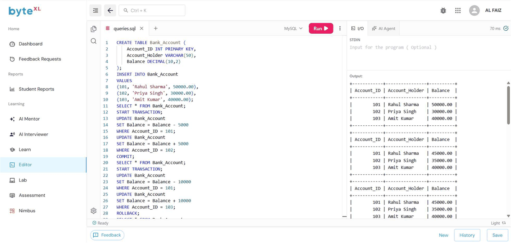

# EXPERIMENT - 8

## AIM
To implement banking-style transactions using `BEGIN`, `COMMIT`, `ROLLBACK`, and `SAVEPOINT`, simulate partial failures, and demonstrate isolation levels and concurrency anomalies using two sessions.

---

## CONCEPTS COVERED

- **ACID Properties**: Atomicity, Consistency, Isolation, and Durability.
- **TCL Commands**:
  - `START TRANSACTION` / `BEGIN`: Initiates a transaction.
  - `COMMIT`: Saves changes permanently.
  - `ROLLBACK`: Undoes uncommitted changes.
  - `SAVEPOINT`: Sets an intermediate checkpoint to allow partial rollbacks.
- **Transaction Isolation Levels**:
  - `READ COMMITTED`
  - `REPEATABLE READ`
  - `SERIALIZABLE`

---

## SOURCE CODE

```sql
-- 1. Create Table
CREATE TABLE Bank_Account ( 
    Account_ID INT PRIMARY KEY, 
    Account_Holder VARCHAR(50), 
    Balance DECIMAL(10,2) 
);

-- 2. Insert Sample Records
INSERT INTO Bank_Account 
VALUES 
(101, 'Rahul Sharma', 50000.00), 
(102, 'Priya Singh', 30000.00), 
(103, 'Amit Kumar', 40000.00);

SELECT * FROM Bank_Account;

-- ========================================================
-- SCENARIO 1: SUCCESSFUL TRANSFER WITH COMMIT
-- Transfer 5,000 from Rahul (101) to Priya (102)
-- ========================================================

START TRANSACTION;

UPDATE Bank_Account 
SET Balance = Balance - 5000 
WHERE Account_ID = 101;

UPDATE Bank_Account 
SET Balance = Balance + 5000 
WHERE Account_ID = 102;

COMMIT;

SELECT * FROM Bank_Account;

-- ========================================================
-- SCENARIO 2: TRANSACTION FAILURE & ROLLBACK
-- Simulate failure during transfer to Amit (103)
-- ========================================================

START TRANSACTION;

UPDATE Bank_Account 
SET Balance = Balance - 10000 
WHERE Account_ID = 101;

UPDATE Bank_Account 
SET Balance = Balance + 10000 
WHERE Account_ID = 103;

-- Rolling back reverts all modifications
ROLLBACK;

SELECT * FROM Bank_Account;

-- ========================================================
-- SCENARIO 3: PARTIAL ROLLBACK USING SAVEPOINT
-- ========================================================

START TRANSACTION;

UPDATE Bank_Account 
SET Balance = Balance - 3000 
WHERE Account_ID = 101;

SAVEPOINT transfer_point;

UPDATE Bank_Account 
SET Balance = Balance + 3000 
WHERE Account_ID = 102;

-- Partial rollback to savepoint
ROLLBACK TO transfer_point;

COMMIT;

SELECT * FROM Bank_Account;

-- ========================================================
-- SCENARIO 4: SAVEPOINT WITH ALTERNATIVE DESTINATION
-- ========================================================

START TRANSACTION;

UPDATE Bank_Account 
SET Balance = Balance - 2000 
WHERE Account_ID = 101;

SAVEPOINT before_second_transfer;

UPDATE Bank_Account 
SET Balance = Balance + 2000 
WHERE Account_ID = 102;

-- Rollback second part and redirect to Account 103
ROLLBACK TO before_second_transfer;

UPDATE Bank_Account 
SET Balance = Balance + 2000 
WHERE Account_ID = 103;

COMMIT;

SELECT * FROM Bank_Account;

-- ========================================================
-- TRANSACTION ISOLATION LEVELS & CONCURRENCY
-- ========================================================

-- 1. READ COMMITTED
SET SESSION TRANSACTION ISOLATION LEVEL READ COMMITTED;
START TRANSACTION;
SELECT * FROM Bank_Account WHERE Account_ID = 101;
COMMIT;

-- 2. REPEATABLE READ
SET SESSION TRANSACTION ISOLATION LEVEL REPEATABLE READ;
START TRANSACTION;
SELECT * FROM Bank_Account WHERE Account_ID = 101;
COMMIT;

-- 3. SERIALIZABLE
SET SESSION TRANSACTION ISOLATION LEVEL SERIALIZABLE;
START TRANSACTION;
SELECT * FROM Bank_Account WHERE Account_ID = 101;
COMMIT;

-- Demonstrating Concurrent Updates under READ COMMITTED
SET SESSION TRANSACTION ISOLATION LEVEL READ COMMITTED;
START TRANSACTION;
SELECT Balance FROM Bank_Account WHERE Account_ID = 101;
UPDATE Bank_Account SET Balance = Balance - 5000 WHERE Account_ID = 101;
COMMIT;

SET SESSION TRANSACTION ISOLATION LEVEL READ COMMITTED;
START TRANSACTION;
SELECT Balance FROM Bank_Account WHERE Account_ID = 101;
UPDATE Bank_Account SET Balance = Balance - 3000 WHERE Account_ID = 101;
COMMIT;

SELECT * FROM Bank_Account WHERE Account_ID = 101;
```

---

## OUTPUT



### Tabular Summary

#### 1. Initial State
| Account_ID | Account_Holder | Balance |
| :--- | :--- | :--- |
| 101 | Rahul Sharma | 50000.00 |
| 102 | Priya Singh | 30000.00 |
| 103 | Amit Kumar | 40000.00 |

#### 2. After Successful `COMMIT` (Scenario 1)
| Account_ID | Account_Holder | Balance |
| :--- | :--- | :--- |
| 101 | Rahul Sharma | 45000.00 |
| 102 | Priya Singh | 35000.00 |
| 103 | Amit Kumar | 40000.00 |

#### 3. After `ROLLBACK` (Scenario 2)
| Account_ID | Account_Holder | Balance |
| :--- | :--- | :--- |
| 101 | Rahul Sharma | 45000.00 |
| 102 | Priya Singh | 35000.00 |
| 103 | Amit Kumar | 40000.00 |
> *(Balances remained unchanged because of rollback)*

#### 4. After `SAVEPOINT` and Partial Rollback (Scenario 3)
| Account_ID | Account_Holder | Balance |
| :--- | :--- | :--- |
| 101 | Rahul Sharma | 42000.00 |
| 102 | Priya Singh | 35000.00 |
| 103 | Amit Kumar | 40000.00 |

#### 5. After Redirected Transfer with Savepoint (Scenario 4)
| Account_ID | Account_Holder | Balance |
| :--- | :--- | :--- |
| 101 | Rahul Sharma | 40000.00 |
| 102 | Priya Singh | 35000.00 |
| 103 | Amit Kumar | 42000.00 |

#### 6. Final State After Concurrency Simulation
| Account_ID | Account_Holder | Balance |
| :--- | :--- | :--- |
| 101 | Rahul Sharma | 32000.00 |
